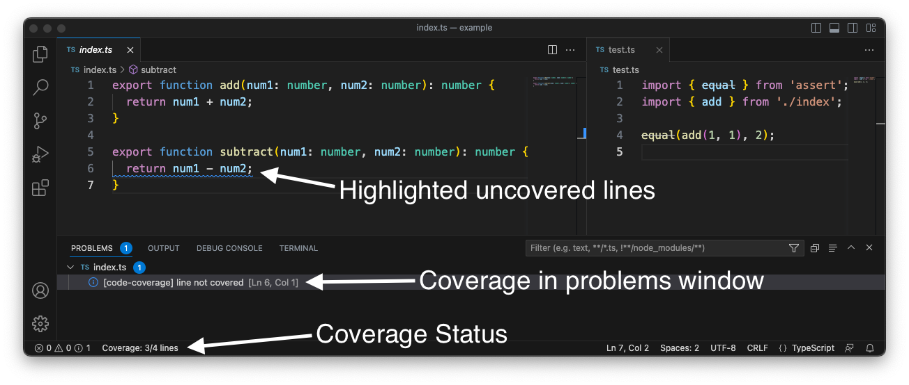

# Code Coverage

Code coverage will put squiggly lines under functions, lines or code branches that are not covered by unit tests. And will list the uncovered lines under the problems window.

## Features

* Simple and easy to use
* Small memory and processor footprint
* Multiple lcov file handler

## Setup

* Ensure your project has generated lcov file(s) using [nyc](https://www.npmjs.com/package/nyc), [istanbul](https://www.npmjs.com/package/istanbul) or other code coverage tools.
* Ensure that the generated lcov file(s) meet this extension's search criteria: `coverage/lcov*.info`
  * Basic naming conventions dictate that the lcov files start with `lcov` and have a file extension of `.info`
* Ensure that if the project uses some javascript preprocessor (ie. typescript, babel) that sourcemaps have been enabled
